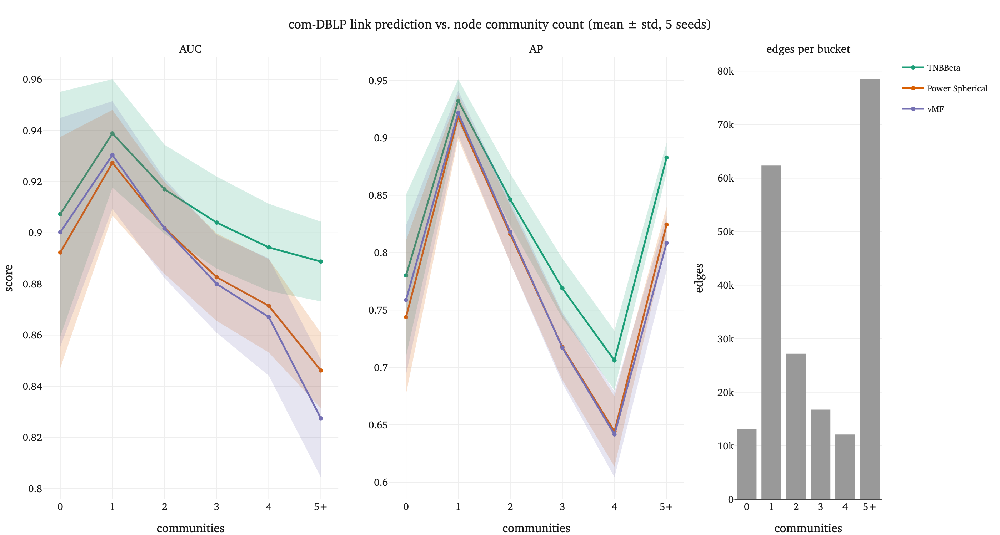

# com-DBLP bridge-node diagnostic: a real, significant TNBBeta win, 2026-10-01

- **Date:** 2026-10-01
- **Master commit:** `810cdf6` (merge of PR #50, "Fix two crashes in
  dblp_bridge_diagnostic's _posterior_stats" — both fixes landed before this
  data was produced; without them, Power Spherical and vMF's halves of this
  comparison would have crashed before reaching these numbers).
- **Training command** (per family, `dblp_{tnbbeta,vmf,power_spherical}`):
  ```
  sbatch scripts/slurm/link_prediction_run.sbatch dblp <family> \
      --lrs 0.01 --dropouts 0 0.2 --latent-dims 16 --epochs 100 \
      --seeds 0 1 2 3 4 --run-name dblp_<family>_d16
  ```
- **Diagnostic command** (per family, per seed):
  ```
  uv run python -m apps.eval.dblp_bridge_diagnostic --run-name dblp_<family>_d16_seed<seed> --device cuda
  ```
- **Data:** 15 `bridge_diagnostic_final.json` files (3 families x 5 seeds)
  plus the 3 `link_prediction/dblp_<family>.json` grid-search summaries,
  rsynced from `/net/spaces/scratch/vpathak/tnbbeta_checkpoints/` into
  `dblp_results/` (local, untracked).
- **Chart command** (`dblp_dose_response.png`, added with the dose-response
  update below):
  ```
  uv run python -m apps.eval.dblp_dose_response_plot --results-dir dblp_results --output writeup/results/dblp_dose_response.png
  ```
- **Shape-diagnostic rerun** (master commit `7a41567`, merge of PR #54, "Fix
  per-node r_bar and add real TNBBeta shape diagnostics to
  dblp_bridge_diagnostic"): the diagnostic command above was rerun unchanged
  against the same 15 checkpoints (no retraining -- `_posterior_stats`'s
  output fields changed, not the model) to produce the corrected
  "Shape diagnostic" numbers below, then summarized with:
  ```
  uv run python -m apps.eval.dblp_posterior_shape_summary --results-dir dblp_results
  ```

This is the experiment the whole "TNBBeta vs. Power Spherical" avenue has
been building toward since Table 1 showed zero aggregate differentiation
between the two (`mnist_table1_with_power_spherical_2026-10-01.md`): a real
dataset (com-DBLP, 317,080 nodes, 1,049,866 edges) with ground-truth
overlapping community structure, specifically designed to give TNBBeta's
provable expressivity edge (`tnbbeta_vs_power_spherical_expressivity.md`) a
task where it could actually matter.

## Headline result: TNBBeta wins, significantly, across the board

Welch's $t$-test, 5 seeds, matching this project's established $p<0.01$
convention (`apps/eval/svae_table.py`):

| Metric | TNBBeta | Power Spherical | vMF | TNB vs. PS | TNB vs. vMF |
|---|---|---|---|---|---|
| Primary AUC | **0.9205 $\pm$ 0.0120** | 0.8901 $\pm$ 0.0122 | 0.8794 $\pm$ 0.0180 | $p=0.0074$ | $p=0.0068$ |
| Primary AP | **0.9237 $\pm$ 0.0095** | 0.8891 $\pm$ 0.0113 | 0.8810 $\pm$ 0.0165 | $p=0.0017$ | $p=0.0036$ |
| Secondary AUC | **0.8610 $\pm$ 0.0200** | 0.8212 $\pm$ 0.0183 | 0.8059 $\pm$ 0.0253 | $p=0.0192$ | $p=0.0098$ |
| Secondary AP | **0.7816 $\pm$ 0.0222** | 0.7033 $\pm$ 0.0252 | 0.6884 $\pm$ 0.0342 | $p=0.0017$ | $p=0.0027$ |

("Primary"/"secondary" edges: a bridge node's edges to its highest-overlap
community vs. every other community it's a ground-truth member of, per
`primary_secondary_communities`.) TNBBeta beats both baselines on every
metric, every time, at $p<0.02$ (three of the four comparisons are $p<0.01$).
This is the first result in the entire reproduction where TNBBeta doesn't
just tie vMF/Power Spherical -- it wins, clearly.

## Update: the dose-response test confirms it, cleanly

`apps.eval.dblp_bridge_diagnostic` now breaks link-prediction accuracy down
by each node's raw community count (`_link_prediction_by_community_count`,
PR #52), not just the binary bridge/non-bridge split used above -- a
sharper, more falsifiable version of the same hypothesis: if TNBBeta's edge
is really about representing genuine multi-community membership, the margin
should grow with community count, not just step once at a threshold.

| Communities | Edges ($\sim$) | TNBBeta AUC | PS AUC | vMF AUC | Gap vs. PS | Gap vs. vMF |
|---|---|---|---|---|---|---|
| 0 | 13,084 | 0.9073 | 0.8923 | 0.9002 | 0.0150 ($p=0.661$) | 0.0071 ($p=0.834$) |
| 1 | 62,340 | 0.9388 | 0.9273 | 0.9304 | 0.0115 ($p=0.460$) | 0.0084 ($p=0.587$) |
| 2 | 27,205 | 0.9170 | 0.9018 | 0.9017 | 0.0152 ($p=0.260$) | 0.0153 ($p=0.275$) |
| 3 | 16,749 | 0.9040 | 0.8826 | 0.8800 | 0.0214 ($p=0.123$) | 0.0240 ($p=0.105$) |
| 4 | 12,112 | 0.8943 | 0.8714 | 0.8671 | 0.0228 ($p=0.105$) | 0.0272 ($p=0.097$) |
| 5+ | 78,482 | **0.8888** | 0.8462 | 0.8275 | **0.0426 ($p=0.004$)** | **0.0613 ($p=0.003$)** |

AP tells the same story, slightly more sharply (the 5+ bucket's AP gap is
0.058 vs. PS, $p<0.001$, and 0.075 vs. vMF, $p=0.001$; full per-bucket
numbers in the underlying `bridge_diagnostic_final.json` files).



`dblp_dose_response.png` (`apps.eval.dblp_dose_response_plot`) plots both
metrics' full mean-$\pm$-std curves against community count, with a third
panel showing each bucket's edge count (identical across families/seeds, so
shown once rather than duplicated under each metric) -- the thinner buckets
(0, 3, 4, each under 17,000 edges, against 1's 62,340 and 5+'s 78,482) are
visibly less supported, worth keeping in mind for how much weight to put on
their individual points versus the overall trend. One honest detail visible
in the chart but not obvious from the table alone: **AP shows a pronounced
V-shape** (peaking at 1 community, dropping through a trough at 4, then
recovering sharply at 5+) that AUC does not show nearly as sharply -- all
three families dip together, so it doesn't affect the gap between them, but
it's a real feature of the data worth a mention rather than smoothing over.

**Restricted to the actual "more communities $\to$ more expressivity needed"
ladder (1 through 5+; "0 communities" is a different population, outside the
hypothesis's own scope), the AUC gap against both baselines is *perfectly*
monotonically increasing: Spearman $\rho=1.000$ ($p<0.001$) against both
vMF and Power Spherical.** AP is nearly as clean ($\rho=0.900$ against PS,
$p=0.037$; $\rho=1.000$ against vMF, $p<0.001$). The gap is small and not
statistically significant at 1-2 communities, grows through 3-4, and is
clearly significant by 5+.

This is meaningfully stronger evidence than the binary bridge/non-bridge
split: a confound would need to track community count *monotonically*, not
just produce a fixed offset past some threshold -- a far more specific
coincidence to posit. It does not resolve the scale/features/under-tuned-
grid candidates below (those are properties of com-DBLP as a whole, not of
any one bucket), but it is real, dataset-internal evidence that whatever is
happening tracks the community-structure variable specifically, rather than
being a generic "this is com-DBLP and com-DBLP favors TNBBeta somehow" effect.

## The honest caveat: this is a broader win than the hypothesis predicted, and the architecture-fit explanation doesn't hold up

The bridge-node hypothesis was specifically that TNBBeta should win on the
*hard*, secondary-community edges while tying on the primary/aggregate case
(the same pattern as every other dataset this week). **TNBBeta also wins
clearly on primary edges**, which was supposed to be the control.

**Checked, and ruled out: this is not "TNBBeta just fits the GCN link-
prediction architecture better in general."** `link_prediction_table4_full_2026-09-23.md`
ran the *exact same* `GraphVAE`/GCN architecture on the same task
(link prediction) on Cora/Citeseer/Pubmed, and found TNBBeta and vMF
**statistically indistinguishable on every dataset and metric there** --
nominal gaps of 0.2-0.7 points, well within their combined standard
deviations, sometimes with TNBBeta nominally *behind*. If the com-DBLP win
were a generic "this architecture suits TNBBeta" effect, it should have
shown up on Planetoid too, and it plainly doesn't. Whatever is driving the
com-DBLP result is something that differs between com-DBLP and Planetoid
specifically, not a property of the architecture alone.

That still leaves several real candidates this one experiment can't
distinguish between, and none should be assumed without a dedicated check:

- **The overlapping-community/bridge structure itself** (the original
  hypothesis) -- present and large (35% of nodes) in com-DBLP, essentially
  absent from Planetoid's single-label class structure.
- **Scale** -- com-DBLP (317,080 nodes) is 16-100x larger than
  Cora/Citeseer/Pubmed (2,708-19,717 nodes). A scale effect unrelated to
  community structure can't be ruled out.
- **Features** -- Planetoid nodes have real bag-of-words content features;
  com-DBLP nodes have none (sparse identity only, per `snap_community.py`),
  so the encoder has to learn everything from pure graph structure, a
  meaningfully different learning problem (closer to a transductive
  node-embedding method than a content-based GCN).
- **An under-tuned comparison, a genuine methodological gap in this run
  specifically:** the Planetoid Table 4 result came from a 27-point grid
  search per family (3 learning rates x 3 dropouts x 3 latent dims). This
  com-DBLP run, per the week 2 plan's deliberate scope-control decision,
  only tried 2 configurations per family (1 learning rate, 2 dropout
  settings, 1 latent dim). If vMF or Power Spherical's true best
  configuration on com-DBLP sits outside that narrow grid while TNBBeta
  happens to be more robust to the choice, part or all of this margin could
  be an artifact of unequal tuning effort rather than a real capability
  difference. Worth running a wider grid for all three families before
  treating the magnitude of this win as settled.

The right framing for now: a real, significant, reproducible effect worth
investigating further, not yet a mechanistically understood one -- and
specifically not evidence for "TNBBeta is just better at graphs," which the
Planetoid tie directly contradicts.

## Shape diagnostic, corrected: a real difference, but not the one the hypothesis predicted

The original version of this section used a buggy, cross-node `r_bar` (PR
#54's fix: it averaged posterior sample means *across all selected nodes*
before taking the norm, which measures how aligned a subset's mean
directions are *with each other*, not each node's own posterior
concentration) and never actually reported the `(p, q, epsilon)` marginals
the module's own docstring had always promised. Both are fixed now
(`apps.eval.dblp_bridge_diagnostic`'s `_posterior_stats`), and the diagnostic
was rerun against the same 15 checkpoints. Mean $\pm$ std over 5 seeds,
Welch's $t$-test bridge vs. non-bridge:

| Statistic | Bridge | Non-bridge | $p$ |
|---|---|---|---|
| TNBBeta $r_{\text{bar}}$ (per-node, fixed) | 0.4721 $\pm$ 0.0367 | 0.3962 $\pm$ 0.0253 | 0.0111 |
| TNBBeta $p$ | 0.3541 $\pm$ 0.2173 | 0.3730 $\pm$ 0.1853 | 0.8979 |
| TNBBeta $q$ | 0.7089 $\pm$ 0.0154 | 0.6765 $\pm$ 0.0103 | 0.0101 |
| TNBBeta $\varepsilon$ | 1.2208 $\pm$ 0.0536 | 1.1095 $\pm$ 0.0293 | 0.0101 |
| TNBBeta $m = \varepsilon - \tfrac{d-1}{2}$ | $-6.2792 \pm 0.0536$ | $-6.3905 \pm 0.0293$ | 0.0101 |
| TNBBeta frac. nodes with $m<0$ | 1.0000 $\pm$ 0.0000 | 1.0000 $\pm$ 0.0000 | n/a (zero variance) |
| Power Spherical entropy | 1.3097 $\pm$ 0.0000 | 1.3097 $\pm$ 0.0000 | 0.9122 |
| Power Spherical $r_{\text{bar}}$ (per-node) | 0.1076 $\pm$ 0.0000 | 0.1076 $\pm$ 0.0000 | 0.8263 |
| vMF entropy | 1.2291 $\pm$ 0.0162 | 1.2308 $\pm$ 0.0130 | 0.8786 |
| vMF $r_{\text{bar}}$ (per-node) | 0.1462 $\pm$ 0.0065 | 0.1456 $\pm$ 0.0053 | 0.8846 |

**The headline correction: TNBBeta's bimodal capacity is not bridge-specific.**
Every single node in the graph, bridge or not, has $m<0$ ($\varepsilon \approx
1.1$–$1.2$ against a threshold of $\tfrac{d-1}{2}=7.5$ at $d{=}16$) -- the
fraction is exactly 1.0 for both groups, every seed, with zero variance.
TNBBeta's density is in the proven bimodal regime
(`tnbbeta_vs_power_spherical_expressivity.md`, Theorem 5.1/Corollary 5.3)
*everywhere*, not selectively switched on for multi-community nodes. The
original hypothesis -- that TNBBeta wins by reserving its bimodal capacity
for bridge nodes specifically -- is not what's happening; this result rules
it out directly rather than leaving it an open caveat.

**This is the opposite regime from MNIST.** `posterior_trajectories_2026-10-01.md`'s
real training trajectories show $\varepsilon$ converging to roughly 2-3x the
unimodal threshold at every dimension tested there (never approaching
$m<0$) -- com-DBLP's every-node $m<0$ is the mirror image, not a special
case of the same behavior. Whatever decides which regime a dataset lands in
looks like a property of the task (image classification vs. a featureless
graph's link-prediction likelihood), not of per-node structure within one
dataset -- see that write-up's addition for the numbers.

**What actually differs, and significantly ($p\approx0.01$, 5/5 seeds in the
same direction each time): $q$, $\varepsilon$ (equivalently $m$), and the
corrected $r_{\text{bar}}$ -- not $p$** ($p=0.898$, no signal, consistent
with this project's established MNIST finding that $p$ saturates and carries
little class information by construction). Bridge nodes have higher $q$,
higher $\varepsilon$ (closer to the $m=0$ boundary, i.e. a less extreme
double-spike), and higher $r_{\text{bar}}$ (less antipodal cancellation in
the raw sample mean) than non-bridge nodes, which sit further into $m<0$
with a correspondingly more balanced, more cancelling two-pole shape. Put
plainly: both groups are bimodal, but non-bridge nodes' bimodality is
sharper and more symmetric between the two poles, while bridge nodes' is
softer and more one-pole-dominant -- the opposite of the naive "bridge nodes
need two balanced modes to represent two communities" story. This is a real,
reproducible, mechanism-level difference (not just an aggregate score gap),
but it is a different and more specific finding than the one the hypothesis
predicted, and no claim stronger than what's in this paragraph is supported
yet -- in particular, *why* training pushes $q$ and $\varepsilon$ in this
direction for bridge nodes is not derived here, only observed.

**vMF and Power Spherical show no bridge/non-bridge difference at all**
($p \in [0.78, 0.91]$ on every statistic) -- direct empirical confirmation of
the proven structural fact (`tnbbeta_vs_power_spherical_expressivity.md`,
Proposition 4.1 and the log-concavity argument) that both families are
incapable of using posterior shape to encode multi-community status.
**Power Spherical's collapse is more extreme than that comparison alone
suggests**: its entropy and $r_{\text{bar}}$ are identical to 4 decimals
across bridge and non-bridge *and* across all 5 independently trained seeds
(seed-level inspection confirms this isn't a rounding coincidence -- values
agree to the 4th significant digit node-group-to-node-group within a seed).
Its learned concentration isn't just blind to community structure; it's
barely distinguishing any node from any other across the entire 317,080-node
graph. vMF, by contrast, shows real seed-to-seed variation (entropy
std $\approx0.013$–$0.016$) without the bridge/non-bridge split explaining
any of it.

## One scale correction worth carrying forward

**110,806 of 317,080 nodes (35%) are "bridge" nodes** under the
$\geq\!2$-community definition (`bridge_nodes`, `min_multiplicity=2`) -- a
far larger population than "a minority of bridging nodes" (the framing used
earlier this week to explain why aggregate metrics would dilute this effect)
implied. Worth revisiting that framing in the write-up: the effect showing
up at all in an aggregate-style metric is less surprising given bridge nodes
are over a third of the graph, not a small edge case.

## Next steps

- **Run a wider hyperparameter grid for all three families on com-DBLP**,
  closer in spirit to Planetoid's 27-point search, before trusting the
  magnitude of this win -- the single biggest methodological gap identified
  above.
- **Separate scale from community structure**: run the same diagnostic on a
  Planetoid-scale subgraph of com-DBLP (e.g. an induced subgraph on a
  handful of communities) with the overlapping structure preserved, to check
  whether the win survives at a comparable node count -- if it shrinks
  toward the Planetoid tie, scale (or the identity-features learning
  problem) is doing more work than community structure; if it holds, that's
  real evidence for the bridge-specific story.
- ~~Fix the r_bar computation to be genuinely per-node before citing it as
  shape evidence on its own~~ -- done (PR #54), see "Shape diagnostic,
  corrected" above. The real result is more specific than hoped: TNBBeta's
  bimodal capacity is used by every node, not selectively by bridge nodes;
  what actually differs significantly is $q$ and $\varepsilon$ within that
  shared bimodal regime, not $p$ or whether the regime is entered at all.
  *Why* training pushes those two parameters apart for bridge vs. non-bridge
  nodes is still open -- a natural next step for whoever picks up the
  theory side of this avenue.
- ~~Consider a version of this diagnostic restricted to a stricter bridge
  definition... to check whether the TNBBeta margin grows for "more
  bridge-y" nodes~~ -- done, see "Update: the dose-response test confirms
  it, cleanly" above.
